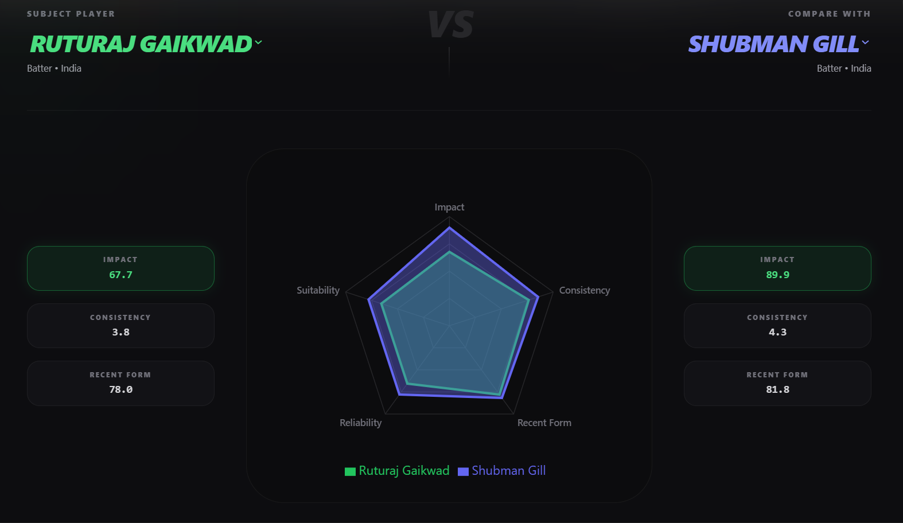
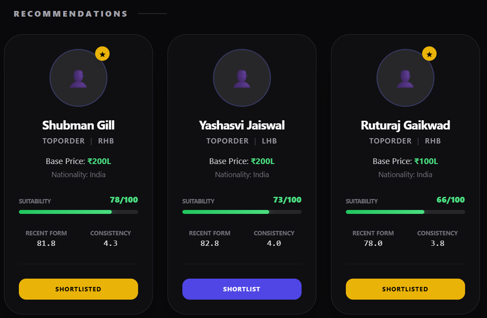
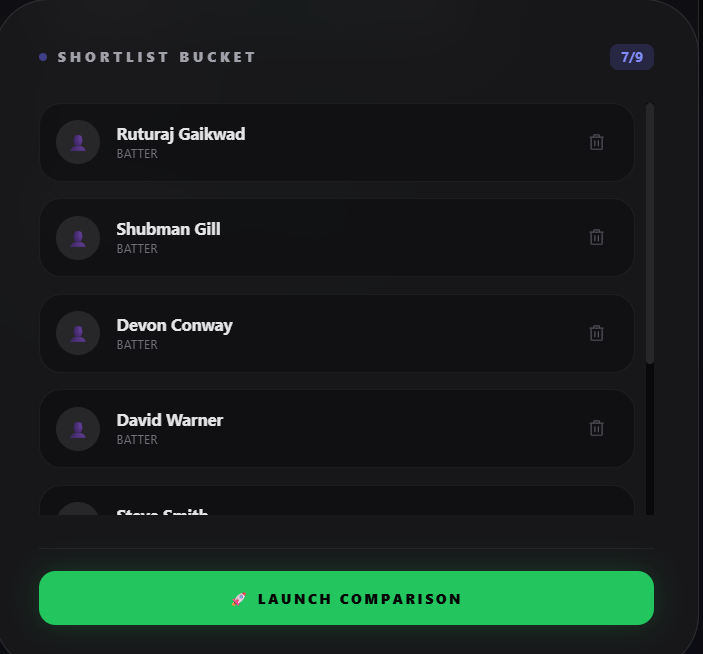

# 🏏 IARS — Intelligent Auction Ready Scout

> **XGBoost-Powered IPL Player Discovery & Comparison Engine**

IARS (Intelligent Auction Ready Scout) is a full-stack AI web application that helps IPL team selectors discover, rank, and compare players using real match data. Built with a Flask + Python ML backend and a React + Tailwind frontend, it combines feature engineering, KMeans clustering, and XGBoost ranking into a clean scouting interface.

---

## 📸 What It Does

- **Filter players** by role, nationality, budget, batting position, bowling type, and more
- **XGBoost ranker** scores every player using impact, consistency, recent form, and cluster type
- **Radar chart comparison** — pit any two players head-to-head with animated overlays
- **Shortlist bucket** — save up to 9 players across sessions using sessionStorage
- **Comparison engine** — full stat table with automatic winner highlighting per metric

---

## 🧠 ML Pipeline Overview

```
players_raw.csv + base_prices_raw.csv
        ↓
  players_processing.py       → players_processed.csv
        ↓
  merge_datasets.py           → features_engineered.csv
        ↓
  consistency.py              → adds consistency_index
        ↓
  impact_score.py             → adds impact_score (0-100)
        ↓
  recent_form.py              → adds recent_form_score, batting/bowling form
        ↓
  clustering.py               → player_clusters.csv (KMeans per role)
        ↓
  add_cluster_labels.py       → features_engineered_with_clusters.csv
        ↓
  build_ranker.py             → ranked_players.csv (XGBoost per role)
        ↓
  Flask API (recommend.py)    → serves top 12 results per filter query
```

## 📸 Screenshots

### Comparison Engine


### Team Builder


###Short List

---

## 🗂️ Project Structure

```
iars/
├── backend/
│   ├── app.py                        # Flask app entry point
│   ├── routes/
│   │   └── recommend.py              # /recommendations POST endpoint
│   ├── pipeline/
│   │   ├── merge_datasets.py
│   │   ├── players_processing.py
│   │   ├── clustering.py
│   │   ├── add_cluster_labels.py
│   │   ├── consistency.py
│   │   ├── impact_score.py
│   │   ├── recent_form.py
│   │   └── build_ranker.py
│   └── data/
│       ├── raw/
│       │   ├── players_raw.csv
│       │   ├── base_prices_raw.csv
│       │   └── performance_raw.csv
│       └── processed/
│           ├── players_processed.csv
│           ├── features_engineered.csv
│           ├── player_clusters.csv
│           ├── features_engineered_with_clusters.csv
│           └── ranked_players.csv
│
└── frontend/
    ├── src/
    │   ├── App.jsx
    │   ├── main.jsx
    │   ├── api/
    │   │   ├── recommend.js           # Axios call with role-based filter cleanup
    │   │   └── playersApi.js          # fetchPlayerById, fetchPlayers
    │   ├── context/
    │   │   └── TeamContext.jsx        # Global state: results, shortlist, player1
    │   ├── pages/
    │   │   ├── TeamBuilder.jsx        # Main page: filters + results grid
    │   │   └── Compare.jsx            # Comparison engine page
    │   ├── components/
    │   │   ├── filters/
    │   │   │   ├── PlayerConstraintsPanel.jsx
    │   │   │   ├── FilterSelect.jsx
    │   │   │   └── BudgetSlider.jsx
    │   │   ├── players/
    │   │   │   ├── PlayerCard.jsx
    │   │   │   ├── PlayerProfile.jsx
    │   │   │   ├── PlayerRadar.jsx    # Recharts RadarChart (single + compare mode)
    │   │   │   └── StatBadge.jsx
    │   │   ├── compare/
    │   │   │   ├── PlayerCompare.jsx
    │   │   │   └── ComparisonTable.jsx
    │   │   ├── summary/
    │   │   │   ├── SummaryCard.jsx
    │   │   │   └── ShortlistTray.jsx
    │   │   └── ui/
    │   │       ├── Button.jsx
    │   │       └── GlassCard.jsx
    │   └── utils/
    │       └── mockPlayers.js
    ├── index.css
    ├── App.css
    └── package.json
```

---

## ⚙️ Tech Stack

| Layer | Technology |
|---|---|
| Frontend | React 18 + Vite |
| Styling | Tailwind CSS + Glassmorphism |
| Charts | Recharts (RadarChart) |
| Routing | React Router v6 |
| State | React Context API + sessionStorage |
| Backend | Flask + Flask-CORS |
| ML | XGBoost, scikit-learn, pandas |
| Data | CSV-based (no database required) |
| HTTP | Axios |

---

## 🚀 Getting Started

### Prerequisites

- Python 3.9+
- Node.js 18+
- pip

---

### 1. Clone the Repository

```bash
git clone https://github.com/yourusername/iars.git
cd iars
```

---

### 2. Backend Setup

```bash
cd backend

# Create virtual environment
python -m venv venv

# Activate it
# Windows:
venv\Scripts\activate
# Mac/Linux:
source venv/bin/activate

# Install dependencies
pip install flask flask-cors pandas scikit-learn xgboost
```

#### Run the ML Pipeline (first time only)

Run these scripts **in order** to generate the processed data:

```bash
python pipeline/players_processing.py
python pipeline/merge_datasets.py
python pipeline/consistency.py
python pipeline/impact_score.py
python pipeline/recent_form.py
python pipeline/clustering.py
python pipeline/add_cluster_labels.py
python pipeline/build_ranker.py
```

This will produce `ranked_players.csv` in `data/processed/`.

#### Start the Flask Server

```bash
python app.py
```

Server runs at: `http://127.0.0.1:5000`

---

### 3. Frontend Setup

```bash
cd frontend

# Install dependencies
npm install

# Start dev server
npm run dev
```

Frontend runs at: `http://localhost:5173`

---

## 🔌 API Reference

### `POST /recommendations`

Returns top 12 ranked players matching the given filters.

**Request Body:**
```json
{
  "role": "Batter",
  "nationality": "Indian",
  "budget": 100,
  "player_type": "Anchor",
  "batting_position": "Toporder",
  "batting_style": "RHB"
}
```

**Response:**
```json
[
  {
    "player_id": "P001",
    "player_name": "Virat Kohli",
    "role": "Batter",
    "country": "India",
    "player_type": "Anchor",
    "base_price_in_lakhs": 200,
    "impact_score": 91.2,
    "consistency_index": 3.75,
    "recent_form_score": 69.4,
    "pred_score": 92.1,
    "rule_score": 88.0
  }
]
```

**Filter fields (all optional):**

| Field | Type | Example Values |
|---|---|---|
| `role` | string | `"Batter"`, `"Bowler"`, `"All-rounder"`, `"Wicketkeeper Batter"` |
| `nationality` | string | `"Indian"`, `"Overseas"` |
| `budget` | number | `100` (in lakhs) |
| `player_type` | string | `"Anchor"`, `"Power Hitter"`, `"Economical"`, `"Wicket Taker"` |
| `batting_position` | string | `"Toporder"`, `"Middleorder"`, `"Lowerorder"` |
| `batting_style` | string | `"RHB"`, `"LHB"` |
| `bowling_style` | string | `"Right-arm"`, `"Left-arm"` |
| `bowling_type` | string | `"Right-arm fast"`, `"Left-arm orthodox"`, etc. |

---

## 🧮 How the Scoring Works

### Impact Score (0–100)
Weighted formula per role:
- **Batter:** runs (35%) + strike rate (25%) + powerplay runs (20%) + death runs (20%)
- **Bowler:** wickets (35%) + powerplay wickets (25%) + death wickets (25%) + economy (15%)
- **All-rounder:** balanced blend of batting and bowling metrics

### Consistency Index (0–5)
Scaled metric based on runs-per-match × strike rate for batters, wickets × economy for bowlers. All-rounders get an average of both.

### Recent Form Score (0–100)
Computed from the last 2 seasons only. Rewards players currently in form, not just career stats.

### XGBoost Pred Score
Final ranking score trained per role using:
- `impact_score` (40%)
- `consistency_index × 20` (30%)
- `recent_form_score` (20%)
- `base_price_in_lakhs` inverse (10%)

### Player Clusters (KMeans, k=3 per role)

| Role | Cluster 0 | Cluster 1 | Cluster 2 |
|---|---|---|---|
| Batter / WK | Anchor | Balanced | Power Hitter |
| Bowler | Economical | Wicket Taker | Death Specialist |
| All-rounder | Batting Heavy | Balanced | Bowling Heavy |

---

## 🖥️ Frontend Features

### Team Builder Page (`/`)
- **Requirement Panel** — role, nationality, budget slider, dynamic filters based on role
- **Results Grid** — 3-column player cards with suitability bar, form, consistency
- **Shortlist Tray** — add up to 9 players, persists on page refresh via sessionStorage
- **Summary Card** — shows current filter selection in natural language

### Comparison Engine (`/compare`)
- **Auto-loads** first two shortlisted players on arrival
- **Animated Radar Chart** — dual overlay using Recharts, 1200ms animation
- **Stat badges** — impact, consistency, recent form side by side
- **Comparison Table** — all metrics with automatic green/indigo winner highlighting
- **Insight cards** — price gap, suitability delta

---

## 🎨 Design System

- **Theme:** Dark glassmorphism — `bg-zinc-950` base, `backdrop-blur-xl` panels
- **Accent colors:** `green-500` (primary actions), `indigo-500` (player 2 / secondary)
- **Typography:** All-caps tracking, `font-black` headings, `font-mono` for stats
- **Cards:** `rounded-[2.5rem]` with `border border-white/10`
- **Animations:** CSS `animate-ping`, `animate-spin`, Recharts `animationDuration={1200}`

---

## 📋 Raw Data Format

Your CSVs in `data/raw/` should follow these schemas:

**players_raw.csv**
```
player_id, player_name, age, country, role, batting_style, batting_position, bowling_style, bowling_type
```

**base_prices_raw.csv**
```
player_id, base_price_in_lakhs
```

**performance_raw.csv**
```
player_id, season, matches, runs, balls_faced, strike_rate, wickets, overs, runs_conceded, economy, powerplay_runs, death_runs, powerplay_wickets, death_wickets, fifties, hundreds, four_wickets, five_wickets
```

---

## 🐛 Known Issues & Fixes Applied

| Issue | Fix |
|---|---|
| `All-rounder` vs `all-rounder` role mismatch | Fuzzy filter in `recommend.py` normalizes hyphens + case |
| `results.map is not a function` crash | Defensive `Array.isArray()` check before every `.map()` |
| Shortlist lost on refresh | Migrated from `localStorage` to `sessionStorage` |
| Player 2 auto-locks on compare page | Empty dependency array `[]` on auto-load `useEffect` |
| Budget filter non-numeric crash | `try/catch` around `float(budget)` in Flask |

---

## 🔮 Planned Features

- [ ] Export shortlist as PDF scouting report
- [ ] Team balance checker (overseas count, role distribution)
- [ ] Live auction simulation mode with countdown timer
- [ ] Player image integration via Cricinfo scraper
- [ ] Season-wise performance trend graphs

---

## 👨‍💻 Author

Built from scratch as a personal project — originally inspired by a chaotic IPL auction played during 12th board exams. The goal was to answer one question: *"What if we had an actual AI tell us who to pick?"*

---

## 📄 License

MIT License — free to use, modify, and build on.# AuctionIQ
